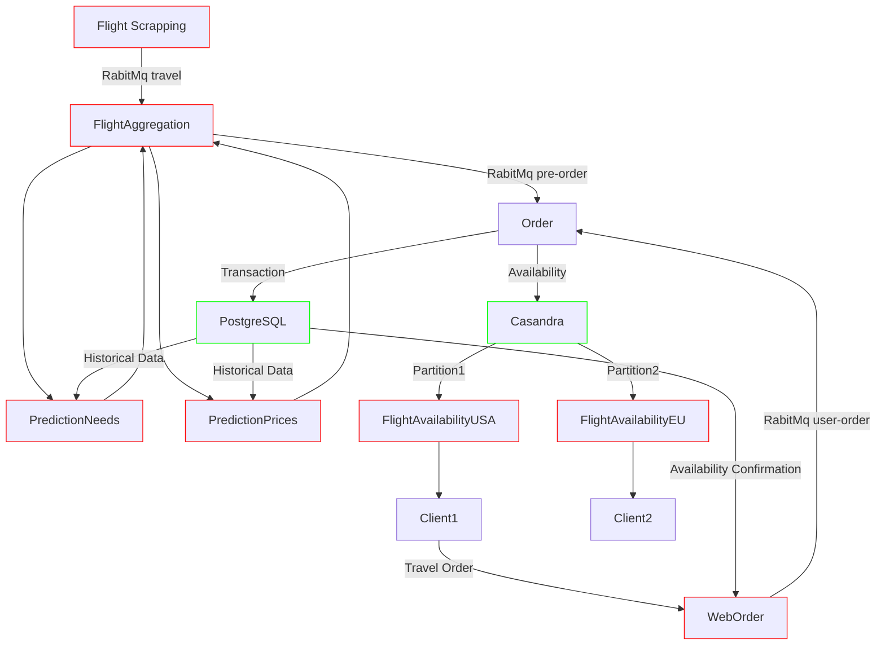

- This is **thought experiment** to practice and validate some theory.
# System Design

## Assumptions
 - 1M Daily impressions.
 - 100K Daily read users
 - 10K Daily write users.
 - 100K Daily flights all over the word.
 

## User Stories
 - As a passenger, i want to view the available locations of flights, so i can plan my vacation order.
 - As a business passenger, i want to have agility of flights, so i can change the dates.
 - As a business traveler agent, i want to book multiple flights at once, so i can manage multiple passengers and destinations.
 

## Milestones / acceptance criteria beak down

### Flight scrapping 
- Given an Airline API, When the price changes, I want to save the new price.

### Flight prediction
- Given some historical Data for a travel, when needed, I want estimate the user flight needs for a date.
- Given some historical price Data for a travel, when needed, I want estimate the best price for a flight.

### Flight aggregation
 - Given a travel price, when it changes, I want to store the new data.
 - Given some travel prices, periodically, I want to create flight need/price predictions.
 - Given estimations on flight needs and prices for a travel, When the price is dropped, I want to pre-order some flights.
  

 ### Flight order
- Given a system travel pre-order, when I execute it, I want to adjust travel availability.
- Given a user-order, when there is availability, then i need to execute the order.
- Given a user-order, when the order is processed, then i want to decrease the destination availability.
 

### Flight availability
- Given a travel and a time frame, when requested, I want to show the available best prices.
- Given a time frame, when requested, I want to show the available travel places.
- Given a travel details, I want to place an order for the user.

## SLOs analysis
Our aviation booking and management system requires a balance between high availability, consistency, and partition tolerance

### High Availability for Flight Prices
  
Solution: Geographical Partitioning with an AP Database (Cassandra). This allows for high availability as reads can be directed to any replica, ensuring flight price data remains accessible even during server outages.

### High Consistency for Order Checking and Payments
  
Solution: CA Database (PostgreSQL). Payment processing and flight availability when limited chairs available require strong consistency guarantees to avoid overbooking and double-charging. PostgreSQL enforces data integrity and ensures all nodes have the same updated information.

### Price Updates and Conflict Resolution
  
Solution: RabbitMQ message queue with Cassandra and PostgreSQL. RabbitMQ allows asynchronous price updates from multiple sources to be queued and delivered to PostgreSQL (for historical data) and Cassandra (for real-time pricing and availability). Timestamps will help identify and resolve potential conflicts during data updates.

